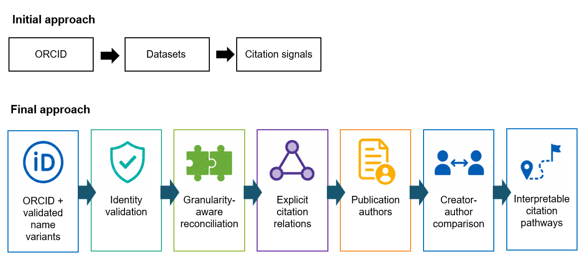
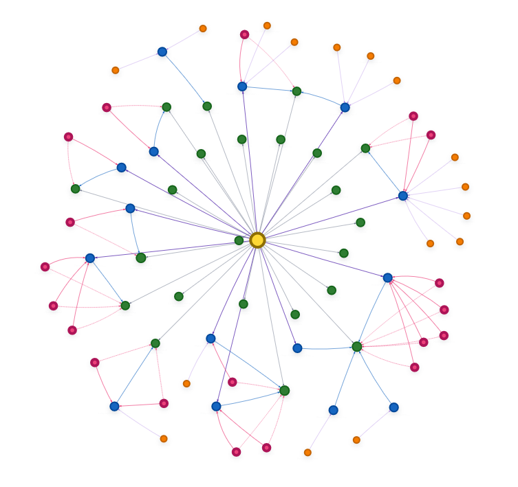
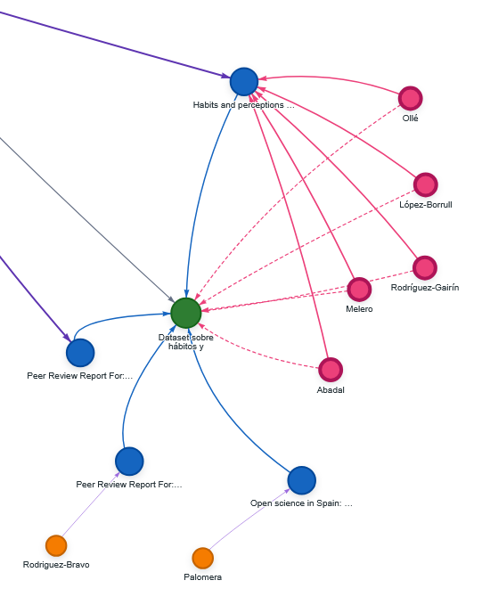
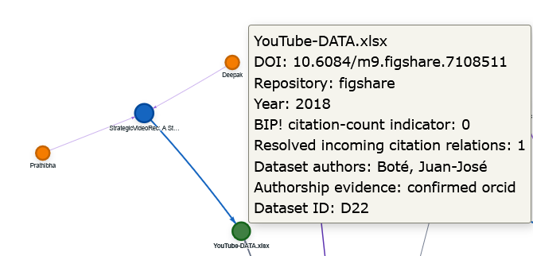

# Data Footprints

**Tracing dataset citation pathways for responsible research assessment**

*OpenAIRE AI Hackathon 2026 · Theme C — Analyse*

## The question

Research assessment increasingly asks institutions to recognise a wider range of contributions, including research data. Yet a dataset citation count alone tells us very little about what happened. Was the dataset cited by the researcher who created it? By another member of the same data-producing team? Or by authors with no overlap with the original creators? And can the underlying citation relationship actually be inspected and verified?

These questions matter not only to institutions, but also to researchers themselves. If research data are to become part of a richer account of research contributions and impact, researchers need ways to understand and communicate what happens to the datasets they produce: where they appear, how they are cited, and whether those citation pathways extend beyond their immediate collaboration networks.

The question behind Data Footprints was therefore: can the OpenAIRE Graph be used to reconstruct transparent, researcher-level evidence about dataset citation pathways that is useful for responsible assessment without turning those pathways into another score?

## The journey

The first prototype started from a simple idea: use an ORCID to retrieve the researcher's datasets and connect them to publications that cite them. Very quickly, however, the apparent simplicity of that workflow exposed several practical issues.

The first challenge was discoverability and identity. ORCID-based retrieval provided a strong starting point, but it did not capture every relevant dataset record. Name variants were therefore added as a complementary recall mechanism. This improved coverage, but also introduced false positives. The workflow was subsequently tightened so that name-based candidates are only retained after strict validation, while ORCID remains the strongest identity signal.

A second challenge was granularity. OpenAIRE does not always expose research data at the same conceptual level: some records represent a complete dataset, while others may correspond to a version, component or even an individual file. This makes researcher-level interpretation difficult, because a set of retrieved records cannot automatically be read as a set of distinct conceptual datasets. Data Footprints therefore applies conservative reconciliation where the available metadata supports it, while retaining records when they cannot be safely merged. The resulting map makes this heterogeneity visible rather than hiding it.

A third turning point came from citation evidence. A product-level citation-count indicator did not always align with the explicit incoming relationships visible through the Graph API. Instead of treating one as the truth and the other as an error, the application now keeps the BIP! citation-count indicator separate from the publication-to-dataset relations resolved through Graph API V3.

The last issue was who is actually behind a citation. A binary distinction between self-citation and external citation proved too simplistic. If the focal researcher is absent from the citing publication but another creator of the dataset is present, that relationship is different from a citation with no shared creator at all. The final workflow therefore distinguishes researcher self-citation, dataset-team citation, external citation and unresolved authorship.

What started as a retrieval exercise became a question of how much evidence could actually be interpreted with confidence.

*Figure 1. From the initial prototype to the final Data Footprints workflow.*

## The insight

The demonstration run with ORCID `0000-0001-9815-6190` showed how much additional context becomes visible when the richer workflow is applied, reconstructing a researcher’s dataset portfolio rather than simply counting it.

*Figure 2. Data Footprints map for the demonstration researcher. The network connects the researcher (yellow) to retained dataset records (green), citing publications (blue) and citing authors, making the structure of the dataset citation portfolio visible at a glance.*

The workflow retrieved 30 dataset records through paginated ORCID queries. Complementary searches across name variants recovered additional candidates, but after validation, overlap checking and reconciliation only one additional name-matched record contributed to the final portfolio, resulting in 23 retained dataset records across four repositories. Twenty-two of the 23 retained records had a DOI.

Citation relationships were visible for 10 of those records. Data Footprints resolved 15 dataset-publication relationships, corresponding to 15 unique citing publications and 34 reconciled author identities. Looking at the people on both sides of each relationship changed the interpretation of those citations: 11 involved the focal researcher, 1 involved another creator of the cited dataset, and 3 showed no detected overlap with the dataset creators.

This is where the difference between the first prototype and the final artifact becomes tangible. What could initially have been reported simply as 15 citation relations becomes a set of qualitatively different pathways once authorship context is taken into account.

*Figure 3. Close-up of a citation pathway. A retained dataset record (green) is connected to citing publications (blue) and their authors. Pink nodes identify citing authors who also created the cited dataset, while orange nodes represent citing authors with no detected creator overlap.*

The run also revealed why relation-level inspection matters. For dataset DOI `10.6084/m9.figshare.7108511`, the product-level BIP! citation-count indicator was 0, while one incoming publication relation was still resolvable through Graph API V3. Data Footprints therefore makes this difference visible instead of silently converting it into one number. This illustrates why responsible assessment benefits from following the evidence path provided by identifiers, relations and people, rather than relying on a decontextualised count.

*Figure 4. Indicator–relation gap for dataset DOI `10.6084/m9.figshare.7108511`. The Data Footprints tooltip shows a BIP! citation-count indicator of 0 alongside one resolved incoming citation relation, keeping the two evidence layers visible and separate.*

The main insight is therefore not simply that datasets can be counted or cited, but that their research trajectories can be inspected. At researcher level, this provides qualitative evidence about how data contributions are represented and connected in the scholarly record. Such evidence could complement narrative accounts of research contribution without being reduced to another performance score.

## What others can reuse

Another user can take the public GitHub repository, run the application with their own eligible Alien Intelligence account, enter any researcher ORCID, and reproduce the same workflow: dataset discovery, conservative authorship validation, record reconciliation, incoming citation retrieval, author-overlap classification and interactive inspection. The repository includes documented dependencies, Windows and macOS/Linux launchers, test ORCIDs, licensing information and the methodological limitations needed to interpret the results responsibly.

Beyond the application itself, the reusable contribution is the method: use persistent identifiers as anchors; distinguish discovery from validation; remain aware of the difference between dataset-type records and conceptual datasets; separate calculated indicators from explicit Graph relations; compare complete dataset-creator and publication-author lists; and preserve uncertainty instead of forcing every case into a score. These steps can be adapted to other researchers, portfolios and assessment workflows.

The resulting evidence can also support situations in which researchers need to describe contributions that are not captured well by publication counts alone. It could, for example, complement narrative CVs, contribution statements or responsible research assessment dossiers by showing not only that datasets exist or have been cited, but how those citation pathways connect datasets, publications and people.

Data Footprints can also help identify gaps in research information. Following records, identifiers and relationships through the Graph can reveal weaknesses in how research data are described, connected or propagated across infrastructures. This can provide practical evidence for improving dataset citation practices, authorship identification, repository metadata and the recording of relationships between datasets and publications.

Data Footprints is not intended to produce a score. It helps users see what evidence is available, how it is connected, and where gaps remain.

---

**Data Footprints v1.0 · OpenAIRE AI Hackathon 2026**  
Concept and development: Anna Caellas-Camprubí  
Scientific supervision / Methodological advice: Ignasi Labastida; Juan-José Boté-Vericad  
© 2026 Anna Caellas-Camprubí. This write-up and the original figures are licensed under CC BY 4.0. See [LICENSE-DOCUMENTATION.md](LICENSE-DOCUMENTATION.md).
